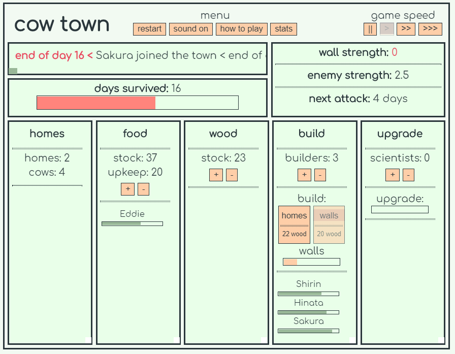
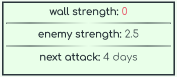
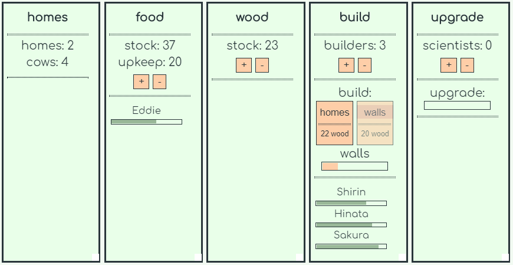

# Cow Town

Cow Town is my first vanilla JS project.

Playable on [Kongregate.](https://www.kongregate.com/games/Pet_Pumpkin/cow-town)

### What is it?

Cow Town is a simple management game in which must expand and defend your town of cows.

I have wanted to make a clone of the awesome game [Despotism 3k](https://store.steampowered.com/app/699920/Despotism_3k/) for quite some time and thought a text based version could work nicely.

### How to play?

As previously stated, the aim of the game is to expand and defend your town of cows.

The player must be aware of two threats:
- Starvation
- The so-called "enemy"

At the end of each day each cow will consume 5 food. Any cows that cannot be fed will die.

The "enemy" attacks every X number of days and is defended against by building walls.

Cows can be assigned various jobs:
- Foraging for food
- Collecting wood
- Building houses or walls
- Doing science (getting upgrades)

Cows are assigned said jobs by clicking on the + or - buttons found within their respective job windows.

*Hint: You can send **all** available cows by holding **SHIFT** and clicking or **half** by holding **ALT** and clicking on the + or -*

*Other keyboard shortcuts are displayed when buttons are hovered over **the game is actually playable completely with the keyboard***

The core loop comprises of collecting enough food to stay alive while collecting enough wood to build your walls up before the enemy attacks. Houses allow more cows to join the village and the upgrades (from science) add bonuses that persist through games, these include increased food / wood collection, slower attack times and more walls to be built.

### Postmortem

As stated at the very top, this is my first project written in vanilla JS. I'm fairly happy with the way the game has come out and I've gotten some nice feedback on Kongregate which motivated me to work on an update for the game. There are still some bugs around and the game balance could use some tweaking but since the game has more or less "peaked" in terms of visability on Kongregate I've decided to use that as a cut off point and just move on and let this first project just be the first project, warts and all rather than getting too caught up and trying to perfect things.

On the more self critical side I don't feel that happy with how messy the code got over time and I'm sure there are ways to vastly improve things. 

That said I am quite excited to look back on this code in the future and see how I've improved and I think I'll revisit this type of game in the future.

Another note, maybe I can't fully say that I'm using pure vanilla JS since I used [Howler.js](https://howlerjs.com/) for the audio. But no matter, it made the audio side really nice and easy and I think implementing that was in its own way another small valuable lesson.

### Thanks

You can visit my website at https://petpumpkin.net
or, follow me on [twitter](https://twitter.com/pet_pumpkin)
or, here's a trailer of a game I made using Unity [Avocado Rescue](https://youtu.be/6UgBex-KuNE)

Cheers, Pet Pumpkin